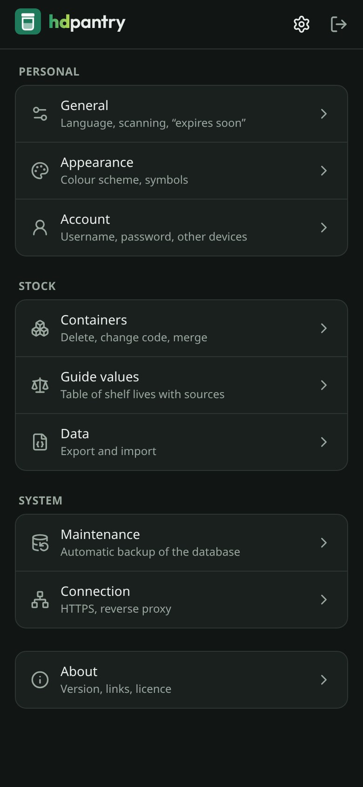

<!-- Logo with wordmark; GitHub picks the variant matching its light or dark theme -->
<p align="center">
  <picture>
    <source media="(prefers-color-scheme: dark)" srcset="docs/brand/wordmark-dark.png" />
    
  </picture>
</p>

<p align="center">
  <a href="https://github.com/dvnkln/hdpantry/releases"></a>
  <a href="https://github.com/dvnkln/hdpantry/pkgs/container/hdpantry"></a>
  <a href="https://github.com/dvnkln/hdpantry/actions/workflows/check.yml"></a>
  <a href="LICENSE"></a>
</p>

<p align="center">
  Self-hosted pantry tracker – know <b>what you have</b> and <b>what should be eaten first</b>. Scan the code on a container, note what is inside, done.
</p>

<p align="center">
  
</p>

## 📖 Documentation

The guides live in the **[wiki](https://github.com/dvnkln/hdpantry/wiki)**:

- 🐳 [Installation](https://github.com/dvnkln/hdpantry/wiki/Installation) – Docker Compose and the `.env` file
- 🔐 [HTTPS](https://github.com/dvnkln/hdpantry/wiki/HTTPS) – reverse proxy, `ORIGIN`, why the camera needs it, installing as an app
- ⬆️ [Updating](https://github.com/dvnkln/hdpantry/wiki/Updating)
- 📅 [Shelf life guide values](https://github.com/dvnkln/hdpantry/wiki/Shelf-life-guide-values) – what the suggested dates are worth and where they come from
- 🔔 [Notifications](https://github.com/dvnkln/hdpantry/wiki/Notifications) – reminders on your devices, through Pushover, ntfy or a webhook
- 📤 [Export and import](https://github.com/dvnkln/hdpantry/wiki/Export-and-import) – your stock as a file
- 💾 [Backups and restore](https://github.com/dvnkln/hdpantry/wiki/Backups-and-restore)
- 🛡️ [Privacy and security](https://github.com/dvnkln/hdpantry/wiki/Privacy-and-security) – what stays on your server, how your data is stored
- 🔑 [Reset your password](https://github.com/dvnkln/hdpantry/wiki/Reset-your-password)
- 💻 [Development](https://github.com/dvnkln/hdpantry/wiki/Development) – running hdpantry from source

What changed in each version: [Changelog](CHANGELOG.md). What's planned: [Roadmap](ROADMAP.md).

## ✨ Features

- 📷 **Scan** – hold a code in front of the camera and hdpantry leads on right away, without a button or a question: a full container shows what is inside, an empty one asks for a name. A photo of the code or typing it works too. Any QR code will do.
- 🥡 **Containers** – every code is one container, added by itself the first time it is scanned. Mark the content as eaten – or replace it in one go – and the container is free for the next thing; scanning it then shows what was in it before, ready to be used again with one tap. Containers without a code can be recorded by hand and merged with their code later.
- 📝 **Quick entry** – one name, then an optional note, vacuum-sealed or not, where it is stored, best before, how full it is and, if you like, how much (g, kg, ml, l, pieces, servings – it follows the fill level). Everything can be corrected later.
- 📅 **Shelf life** – the kind of food and a symbol are suggested from its name (German and English; your corrections are remembered). Suitable places of storage are marked, unsuitable ones locked, and a best-before date is suggested from the kind of food, the place and whether it is vacuum-sealed – [guide values, not a guarantee](#-shelf-life).
- 📋 **In stock** – everything you have, what expires first at the top; expired and soon-to-expire items stand out. Filter by place of storage, sort by date, name or place. Cards on phones, a wide table on computers.
- 🔔 **Reminders** – a message before something expires (once or every day), on the day and after, one by one or as one summary a day from an hour you choose. No extra app, no third-party account – or, if you prefer, through Pushover, ntfy or a webhook (Gotify, Apprise, Home Assistant, …).
- 📤 **Export and import** – your whole stock with its history as one readable file (JSON). Importing replaces the stock, after a clear warning.
- 🧊 **Stock in the cabinet** – a bit of fun you can switch on: pick a place of storage and the list stands inside a drawn fridge, freezer or wooden cabinet.
- 🛠️ **Maintenance built in** – background tasks you can see and schedule, and optional backups of the database that you can download.
- 🎨 **Your look** – follows your device (dark or light) by default, or pick one; food symbols come colourful or as plain line icons.
- 🔒 **Private** – runs on your own server, single account, all data in one SQLite file. No tracking, no cloud, no foreign scripts or fonts. hdpantry connects to nothing outside – unless you set up notifications: then messages go to the targets you added, and nowhere else. [Who sees what](https://github.com/dvnkln/hdpantry/wiki/Privacy-and-security) is documented. Repeated wrong passwords block the address they come from – also behind a reverse proxy.

## 📅 Shelf life

hdpantry suggests a best-before date so you keep track of what to eat first. **These dates are estimates based on published sources – not a guarantee and no substitute for your own judgement:** always look at food and smell it before eating, and if in doubt throw it away. How the values were chosen, the full table and all sources: [Shelf life guide values](https://github.com/dvnkln/hdpantry/wiki/Shelf-life-guide-values).

## 📱 Screenshots

|                               In stock                                |                                   New content                                    |                                 Details                                  |
| :-------------------------------------------------------------------: | :------------------------------------------------------------------------------: | :----------------------------------------------------------------------: |
|  |  |  |

|                                    Guide values                                    |                                        Appearance                                         |                                Settings                                |
| :--------------------------------------------------------------------------------: | :---------------------------------------------------------------------------------------: | :--------------------------------------------------------------------: |
|  |  |  |

<p align="center"><sub>Screenshots in the dark colour scheme, with an invented demo stock. Colourful symbols: Twemoji.</sub></p>

## 🐳 Quick start

1. Create a folder and download the two files hdpantry needs – the [`docker-compose.yml`](docker-compose.yml) and a template for your settings, saved as `.env`:

   ```bash
   mkdir hdpantry && cd hdpantry
   curl -fsSLO https://raw.githubusercontent.com/dvnkln/hdpantry/main/docker-compose.yml
   curl -fsSL -o .env https://raw.githubusercontent.com/dvnkln/hdpantry/main/.env.example
   ```

2. Open `.env` and fill it in: a random `SECRET`, your time zone and `ORIGIN` – **exactly** the address you open the app with, e.g. `http://192.168.1.50:3000`. The file explains every line.

3. Start it and open that address. On first start you create your account.

   ```bash
   docker compose up -d
   ```

The camera scanner needs HTTPS (a rule of the browsers); hdpantry expects a reverse proxy for that – see [HTTPS](https://github.com/dvnkln/hdpantry/wiki/HTTPS). What every setting means: **[Installation guide](https://github.com/dvnkln/hdpantry/wiki/Installation)**.

## 🙏 Credits

Colourful food symbols: [Twemoji](https://github.com/jdecked/twemoji), © Twitter, Inc and other contributors, licensed under [CC BY 4.0](https://creativecommons.org/licenses/by/4.0/). Plain symbols: [Lucide](https://lucide.dev) (ISC License) and [Tabler Icons](https://tabler.io/icons) (MIT License). Wordmark font: [Outfit](https://github.com/Outfitio/Outfit-Fonts) (SIL Open Font License). All of them are bundled with the app – nothing is loaded from elsewhere.

## 🤖 Built with AI

hdpantry is heavily AI-assisted, and I want to be upfront about that. Most of the code is written by [Claude Code](https://claude.com/claude-code), Anthropic's AI coding assistant.

My part is the product side: what hdpantry should do, how it should look and feel, and how it should behave. I describe ideas and decisions, review and test every change in a running instance, and decide what goes into a release. The AI turns that into code, tests it and documents it.

If you find a bug or something that looks odd in the code, please open an [issue](https://github.com/dvnkln/hdpantry/issues) – that helps.

## 📜 License

[GNU AGPL v3](LICENSE) – you may use, change and share hdpantry freely. If you distribute a modified version or offer it to others over a network, you have to publish your changes under the same license. This is a personal project, provided as-is without support or guarantees; if it's useful to you too, even better.
